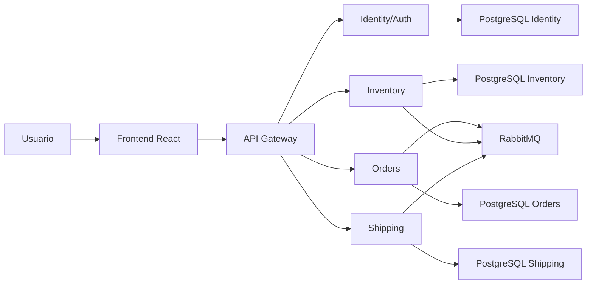

# Arquitectura SmartLogix

SmartLogix separa responsabilidades en frontend, gateway y microservicios. El frontend nunca llama directamente a servicios internos: usa el API Gateway, que valida JWT y enruta hacia los dominios operacionales.

## Componentes

- API Gateway: valida JWT, aplica reglas de acceso, expone `/api/system/health` y enruta requests.
- Identity/Auth: emite JWT, entrega `/api/auth/me` y gestiona usuarios del sistema.
- Inventory: administra productos, bodegas, stock y movimientos.
- Orders: administra clientes, pedidos, items, confirmacion, cancelacion e historial.
- Shipping: administra envios, transportistas, asignaciones, tracking y estados.
- Frontend: UI operacional con permisos por rol, dashboard, reportes y configuracion.

## Flujo operacional

1. El usuario inicia sesion contra Identity a traves del Gateway.
2. El frontend guarda solo datos de sesion necesarios y consulta `/api/auth/me`.
3. Inventario entrega productos, stock y bodegas reales.
4. Pedidos usa clientes y productos seleccionados para crear ordenes.
5. Envios usa pedidos y transportistas para asignar despacho y actualizar estado.
6. Reportes y Dashboard calculan indicadores desde los datos reales cargados.

## Health

`GET /api/system/health` en el Gateway consulta `/actuator/health` de Identity, Inventory, Orders y Shipping. El frontend muestra estado por servicio y banners contextuales cuando un dominio esta temporalmente no disponible.
